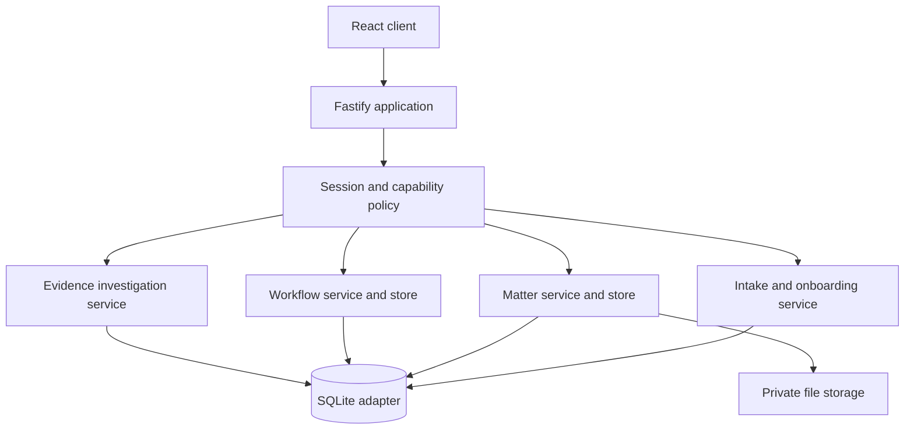

# SwiftClaim Litigation

SwiftClaim Litigation is the working foundation of a modern, AI-ready litigation operating system for claimant law firms. The current product combines a secure matter spine, governed claimant intake and onboarding, atomic matter opening, a structured Housing Conditions evidence investigation, the first operational workflow, and a Matter 360 workspace. It is not yet the complete case-management programme.

This repository contains a real full-stack application, not a static prototype. The React interface uses a Fastify API, a durable SQLite database, private file storage, secure sessions, firm and matter-level access rules, versioned workflows, explainable deadline calculations, and append-only evidential records.

## What works now

- secure email/password sessions with scrypt hashes and revocation;
- server-derived firm isolation on every tenant-owned query;
- role and matter membership permissions;
- litigation dashboard with urgent work and deadline counts;
- matter creation with Proclaim-compatible migration identifiers;
- a claimant Housing Conditions enquiry queue with search, status and assignee filters;
- governed conflict checks, legal assessment, acceptance, client onboarding and atomic conversion;
- canonical contacts, households, properties, landlords and tenancies linked into Matter 360;
- parties, tasks, assignments, completion history, and matter chronology;
- private document upload, SHA-256 hashing, immutable version rows, and authorised downloads;
- structured defects with optimistic versions and append-only status history;
- immutable landlord notice, access and evidence records linked to exact document versions;
- explainable evidence readiness and simultaneous investigation risk flags;
- append-only audit records protected by database triggers;
- ordered, transactional database migrations;
- responsive desktop, tablet, and mobile interface;
- seeded two-firm evaluation dataset;
- automated domain, security, API, client, and production-build checks.

### Claimant intake and onboarding

- dense enquiry queue and responsive five-section workspace: Enquiry, Conflicts, Assessment, Onboarding and Decision;
- explicit human conflict decisions—search results never clear a conflict automatically;
- solicitor-reviewed jurisdiction, relationship, notice, unresolved conditions, access, evidence, limitation, legal issues, merits and proportionality controls;
- partner review gates for configured urgent escalations;
- acceptance, decline, referral, duplicate and unable-to-contact outcomes with immutable status history and reasons;
- identity, client-care, authority, privacy, funding and signature statuses;
- vulnerability, accessibility, interpreter and safe-contact instructions, plus a multi-person household register;
- property, landlord, occupancy, tenancy and integer-minor-unit rent records;
- server-projected readiness blockers so the browser cannot declare a file ready itself;
- optimistic versions on every governed write;
- one idempotent, transactional conversion that either creates the complete matter and workflow or creates nothing;
- converted Matter 360 panels for Client & Household and Property & Tenancy, with a legacy-matter fallback.

AI drafting, document analysis, call transcription and WhatsApp calling are part of the wider product programme; they are not represented as completed capabilities in this build. Human legal decisions and controlled source facts remain authoritative.

### Housing Conditions workflow foundation

- Matter 360 operational overview with the matter header, active alerts, next actions, workflow readiness, and protocol deadlines;
- claimant-side England workflow covering Enquiry, Assessment, Onboarding, Evidence and notice, Pre-Action Protocol, Expert evidence, Repairs and quantum, Negotiation, Proceedings, Settlement, and Closure;
- controlled stage progression with required checklist controls, explicit reasons, optimistic concurrency, role-based overrides, and immutable stage history;
- user-confirmed legal trigger events—SwiftClaim does not infer that a protocol event occurred merely because a document exists;
- versioned workflow definitions, deadline rules, and business calendars so a live matter remains tied to the rule set used at the time;
- immutable deadlines with calculation explanations, source references, status history, generated tasks, audit entries, domain events, and an integration outbox;
- a realistic synthetic evaluation matter, `Clarke v Meridian Housing`, for claimant Maya Clarke at 18 Alder Court, Salford.

### Defects, notice and evidence

- active **Defects & repairs** and **Evidence** Matter 360 sections sharing one lazily loaded investigation resource;
- location-grouped defect schedules with controlled categories, severity, status, reported health impact and descriptive escalation tags;
- optimistic defect updates with append-only status history and an explicit reason for state changes;
- append-only notice chronology covering recipient, channel, proof position, response and correction-by-supersession;
- append-only access history covering offered, scheduled, attempted, completed, refused, no-access and cancelled events;
- evidential classifications for photographs, video, correspondence, repair records, tenancy records, medical links, client statements and other material;
- every evidence item points to one exact immutable document version and displays its filename, version, SHA-256 prefix and provenance;
- atomic links from evidence to defects, notices or access events, with cross-matter and cross-firm targets rejected;
- deterministic readiness controls for the defect schedule, notice proof position and defect-linked photographs;
- all applicable risk flags are returned together, including serious unresolved defects, unlinked defects, notice proof gaps, failed access and missing photographs;
- browser checklist ticks cannot declare objective evidence complete—the workflow validates each supplied control against the server projection;
- partner/admin override remains available only with an explicit reason and retains unresolved objective blockers in immutable history.

SwiftClaim records source facts and review controls. It does not determine liability, breach, causation, limitation, hazard classification or quantum.

The initial deadline rules are grounded in the official [Pre-Action Protocol for Housing Conditions Claims (England)](https://www.justice.gov.uk/courts/procedure-rules/civil/protocol/prot_hou):

| Confirmed event | SwiftClaim calculation |
|---|---|
| Letter of Claim received | Landlord response due after 20 working days |
| Landlord response received | Expert inspection due after 20 working days |
| Expert inspection completed | Expert report or agreed schedule due after 10 working days |

Working-day calculations exclude weekends and configured England and Wales bank holidays. Every result is presented as a calculation to verify before reliance, with its trigger date, excluded-day count, rule version, calendar, and official source retained for review. Rules and calendars must be reviewed whenever the protocol or bank-holiday position changes.

## Quick start

Requirements: Node.js 24 or newer and npm 11 or newer.

```bash
npm install
npm run dev
```

Open `http://127.0.0.1:5173`. Vite proxies the API to `http://127.0.0.1:4100`.

The development command creates `./data/swiftclaim.sqlite` and `./data/uploads`. Both are ignored by Git.

### Evaluation accounts

All seeded users use the password `SwiftClaim!2026`.

| User | Email | Access to demonstrate |
|---|---|---|
| Ava Morgan | `ava@northstar.test` | Solicitor; Leah intake pilot and assigned Northstar matter |
| Marcus Reed | `partner@northstar.test` | Partner; all Northstar matters and matter creation |
| Ben Foster | `ben@northstar.test` | Paralegal; assigned matters only |
| Priya Shah | `finance@northstar.test` | Firm-wide read-only access |
| Lewis Grant | `lewis@southbank.test` | Separate Southbank firm tenant |

Use Ava for both supported evaluation journeys:

1. Open **Enquiries**, then open `Leah Benton` at 42 Hazel Walk. Her conflict and legal review are complete and the enquiry is accepted. Every onboarding control is complete except **Funding status**, which is intentionally `Pending`.
2. Change Funding status to `Complete`, save onboarding, open Decision and convert. SwiftClaim creates the complete Housing Conditions matter atomically at **Evidence and notice**, then opens it in Matter 360 with the client, household, property, landlord and tenancy profile intact.
3. Open `Clarke v Meridian Housing`, then choose **Defects & repairs** to inspect five structured defects across four locations, multi-channel notice history, access outcomes and visible evidence gaps.
4. Choose **Evidence** to inspect readiness, overlapping risks, preserved provenance and exact immutable document-version links. Upload a synthetic document in **Documents** before testing a new evidence link.
5. The longer-running matter remains at Pre-Action Protocol with a governed protocol deadline; newly converted Leah matters open at Evidence and notice so objective readiness can be tested before progression.

Use Marcus to test partner-only workflow overrides. Use Lewis to see Southbank's separate Amara Jones enquiry and verify that Northstar enquiry and matter UUIDs remain invisible across firms. All names, addresses, organisations and claim details in the seed are synthetic and evaluation-only.

## Commands

```bash
npm run dev        # API and web development servers
npm test           # all server and client tests
npm run typecheck  # strict browser and server TypeScript checks
npm run build      # production server and client build
npm start          # serve the production build on port 4100
```

To exercise a production build with demonstration data:

```bash
npm run build
SEED_DEMO_DATA=true npm start
```

Then open `http://127.0.0.1:4100`.

## Architecture

SwiftClaim is a modular monolith. That keeps workflow transitions, deadline creation, tenant controls, and audit records inside one database transaction while the domain is still being validated with the test firm.



The boundaries are deliberately portable:

- `src/shared/contracts.ts` owns validated request contracts;
- `src/server/policy.ts` owns role decisions;
- `src/server/intake/` owns enquiries, conflicts, readiness, onboarding and conversion;
- `src/server/store.ts` owns tenant-scoped matter operations;
- `src/server/workflow/` owns workflow definitions, working-day calculations, transitions, deadlines, and Matter 360 orchestration;
- `src/server/evidence/` owns structured defects, notice/access history, immutable evidence links, readiness, risks and its HTTP boundary;
- `src/server/storage.ts` owns immutable bytes and hashes;
- `src/server/migrations/` owns ordered schema evolution;
- `src/server/app.ts` maps HTTP requests to those boundaries;
- `src/client/` consumes only the public `/api` contracts.

SQLite and local storage are evaluation adapters. The same contracts can move to PostgreSQL and encrypted object storage without rewriting the browser application.

## Security model

The server never accepts a firm identifier from the browser. It resolves the firm and user from a random session token stored in an HTTP-only, same-site cookie. Only the SHA-256 token hash is stored in the database.

Administrative and partner roles can read and write every matter and enquiry in their firm. Solicitors and paralegals need assignment, ownership or explicit membership. Conflict decisions, intake outcomes, overrides and conversion have distinct capability checks. Finance and read-only roles can read firm matters but cannot access claimant intake or mutate records. Inaccessible matters, enquiries and child resources return the same generic `404`, including resources in another firm, to avoid existence disclosure.

Every tenant-owned table carries `firm_id`. Composite foreign keys prevent a child record from crossing a firm boundary. Audit, document-version, notice, access, evidence and evidence-link rows have database triggers that reject updates and deletion. Defect current state uses optimistic versions while every status change is retained separately. Uploaded names never become storage paths; files receive random storage keys and an SHA-256 digest.

Security acceptance tests live in:

- `src/server/security.test.ts`;
- `src/server/database.test.ts`;
- `src/server/app.test.ts`.

## Matter and migration model

SwiftClaim uses its own stable UUIDs as primary keys. `external_source`, `external_id`, and `import_batch_id` preserve Proclaim or other legacy references as compatibility metadata. They never become authoritative identifiers.

This makes the future SwiftBridge flow idempotent and reconcilable:

1. map a source entity to a canonical SwiftClaim entity;
2. retain its legacy key for exception reporting;
3. hash every transferred file for byte-level reconciliation;
4. group imported records by batch;
5. record import actions in the same append-only audit model.

The approved Step 1 design and implementation plan are in `docs/superpowers/`.

## API surface

| Method | Route | Purpose |
|---|---|---|
| `POST` | `/api/auth/login` | Create a secure session |
| `POST` | `/api/auth/logout` | Revoke the session |
| `GET` | `/api/me` | Current user, firm, and permissions |
| `GET` | `/api/dashboard` | Accessible work summary |
| `GET` | `/api/enquiries` | Assigned or firm-wide claimant enquiry queue |
| `POST` | `/api/enquiries` | Create a Housing Conditions enquiry |
| `GET` | `/api/enquiries/:id` | Governed intake workspace and readiness |
| `PATCH` | `/api/enquiries/:id` | Update captured enquiry facts with a version |
| `POST` | `/api/enquiries/:id/conflict-checks` | Search tenant-local conflict candidates |
| `POST` | `/api/enquiries/:id/conflict-decisions` | Record the authorised human conflict decision |
| `PUT` | `/api/enquiries/:id/assessment` | Save the legal assessment and review decision |
| `PUT` | `/api/enquiries/:id/onboarding` | Save opening controls, household and tenancy |
| `POST` | `/api/enquiries/:id/decisions` | Record acceptance or another intake outcome |
| `POST` | `/api/enquiries/:id/convert` | Atomically and idempotently open the governed matter |
| `GET` | `/api/matters` | Accessible matters and search |
| `POST` | `/api/matters` | Create a matter as partner/admin |
| `GET` | `/api/matters/:id` | Full authorised matter aggregate |
| `GET` | `/api/matters/:id/summary` | Matter 360 workflow, deadlines, alerts, and next actions |
| `GET` | `/api/matters/:id/intake-profile` | Converted client, household, property and tenancy profile |
| `GET` | `/api/matters/:matterId/evidence-investigation` | Defects, notice/access history, evidence, readiness, risks and permissions |
| `POST` | `/api/matters/:matterId/defects` | Record a structured defect |
| `PATCH` | `/api/matters/:matterId/defects/:defectId` | Version-controlled defect update and status history |
| `POST` | `/api/matters/:matterId/notices` | Record an append-only notice or correction |
| `POST` | `/api/matters/:matterId/access-events` | Record an append-only access event or correction |
| `POST` | `/api/matters/:matterId/evidence-items` | Atomically link an exact document version to investigation facts |
| `POST` | `/api/matters/:id/workflow/transitions` | Progress a workflow with readiness and version controls |
| `POST` | `/api/matters/:id/workflow/triggers` | Confirm a legal event and calculate its governed deadline |
| `POST` | `/api/matters/:id/parties` | Add a matter party |
| `POST` | `/api/matters/:id/tasks` | Add a task or deadline |
| `PATCH` | `/api/matters/:id/tasks/:taskId` | Update task state |
| `POST` | `/api/matters/:id/documents` | Preserve a document version |
| `GET` | `/api/matters/:id/documents/:documentId/download` | Authorised download |

Every JSON error has the same envelope: `{ "error": { "code", "message", "fields"? } }`.

## Configuration

Copy `.env.example` values into your process environment. The application does not load `.env` files itself; use your preferred secret/runtime manager.

| Variable | Default | Purpose |
|---|---|---|
| `HOST` | `127.0.0.1` | Listen address |
| `PORT` | `4100` | API and production web port |
| `NODE_ENV` | `development` | Cookie, CSRF, cache, and seed posture |
| `DATA_DIR` | `./data` | Default durable data directory |
| `DATABASE_PATH` | `DATA_DIR/swiftclaim.sqlite` | SQLite database path |
| `STORAGE_PATH` | `DATA_DIR/uploads` | Private immutable byte storage |
| `SEED_DEMO_DATA` | true outside production | Add the two-firm evaluation dataset |
| `LOG_LEVEL` | `warn` development, `info` production | Structured server log level |

## Live-data boundary

The current build is suitable for product evaluation with synthetic or properly anonymised data. It is not approved for live client material, and its deadline calculations are not a substitute for solicitor review.

Before a live pilot, replace the evaluation adapters with managed PostgreSQL and encrypted object storage, add SSO and MFA, managed secrets, malware scanning, encrypted and tested backups, centralised audit export, monitoring and alerting, retention and legal-hold policies, vulnerability management, penetration testing, DPIA/data-flow documentation, and the firm's approved regulatory controls.

## Next build

The next case-management slice is **Protocol & Experts** for claimant Housing Conditions work: a controlled Letter of Claim data model and generation flow, service/receipt evidence, landlord response capture, expert instruction, conflict and availability checks, inspection access, report milestones, clarification questions and governed deadline status changes.

That is followed by correspondence and communication capture, repairs and quantum, offers and settlement authority, proceedings, costs and billing, closure, reporting, integrations, then supervised AI assistance across each governed source record. Calling and messaging integrations must preserve consent, identity, recording notices, retention, audit and human-review controls.

SwiftBridge is deliberately deferred until the operational case-management model is sufficiently complete to receive Proclaim data without flattening or losing it. The current external identifiers, import-batch fields, file hashes, audit model, and integration outbox preserve the migration seam. When SwiftBridge begins, its first deliverable should be an anonymised discovery and dry-run import with source inventory, mappings, document manifest, reconciliation totals, and an exception queue before any live cutover.
