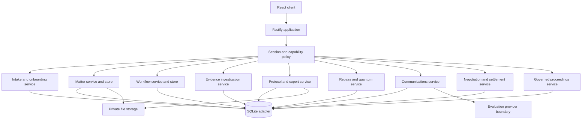

# SwiftClaim Litigation

SwiftClaim Litigation is the working foundation of a modern, AI-ready litigation operating system for claimant law firms. The current product combines a secure matter spine, governed claimant intake and onboarding, atomic matter opening, a structured Housing Conditions evidence investigation, operational Pre-Action Protocol and expert-evidence controls, governed repairs and quantum, governed communications, the first controlled workflow, and Matter 360. It is not yet the complete case-management programme.

This repository contains a real full-stack application, not a static prototype. The React interface uses a Fastify API, a durable SQLite database, private file storage, secure sessions, firm and matter-level access rules, versioned workflows, explainable deadline calculations, and append-only evidential records.

## What works now

- secure email/password sessions with scrypt hashes and revocation;
- server-derived firm isolation on every tenant-owned query;
- role and matter membership permissions;
- litigation dashboard with urgent work and deadline counts;
- matter creation with Proclaim-compatible migration identifiers;
- a claimant Housing Conditions enquiry queue with search, status and assignee filters;
- governed conflict checks, legal assessment, acceptance, client onboarding and atomic conversion;
- canonical contacts, households, properties, landlords and tenancies linked into Matter 360;
- parties, tasks, assignments, completion history, and matter chronology;
- private document upload, SHA-256 hashing, immutable version rows, and authorised downloads;
- structured defects with optimistic versions and append-only status history;
- immutable landlord notice, access and evidence records linked to exact document versions;
- explainable evidence readiness and simultaneous investigation risk flags;
- source-linked Letter of Claim preparation with immutable generated DOCX versions;
- controlled dispatch, receipt, landlord-response and expert-evidence records;
- expert route, identity, conflict, terms, instruction, inspection, report and clarification controls;
- versioned schedules of works, append-only repair events and evidence-backed completion verification;
- server-calculated schedules of loss, human valuation provenance and approval gates for evidence gaps;
- physically segregated open and protected offers with controlled Part 36 date projections;
- one governed email, WhatsApp, letter, telephone and internal communication ledger with exact document-version attachments;
- versioned drafts, approval gates, explicit dispatch confirmation, provider-event projection, call identity/recording provenance and reviewable service assertions;
- human-authored negotiation reviews, immutable client instructions, versioned authority, exact-term approval gates, settlement terms and evidence-backed obligations;
- governed civil proceedings with independent issue authority, exact filings, per-recipient service, applications, sealed orders, atomic directions and hearings;
- append-only audit records protected by database triggers;
- ordered, transactional database migrations;
- responsive desktop, tablet, and mobile interface;
- seeded two-firm evaluation dataset;
- automated domain, security, API, client, and production-build checks.

### Claimant intake and onboarding

- dense enquiry queue and responsive five-section workspace: Enquiry, Conflicts, Assessment, Onboarding and Decision;
- explicit human conflict decisions—search results never clear a conflict automatically;
- solicitor-reviewed jurisdiction, relationship, notice, unresolved conditions, access, evidence, limitation, legal issues, merits and proportionality controls;
- partner review gates for configured urgent escalations;
- acceptance, decline, referral, duplicate and unable-to-contact outcomes with immutable status history and reasons;
- identity, client-care, authority, privacy, funding and signature statuses;
- vulnerability, accessibility, interpreter and safe-contact instructions, plus a multi-person household register;
- property, landlord, occupancy, tenancy and integer-minor-unit rent records;
- server-projected readiness blockers so the browser cannot declare a file ready itself;
- optimistic versions on every governed write;
- one idempotent, transactional conversion that either creates the complete matter and workflow or creates nothing;
- converted Matter 360 panels for Client & Household and Property & Tenancy, with a legacy-matter fallback.

AI drafting, document analysis, call transcription and live WhatsApp calling are part of the wider product programme; they are not represented as completed capabilities in this build. Human legal decisions and controlled source facts remain authoritative.

### Housing Conditions workflow foundation

- Matter 360 operational overview with the matter header, active alerts, next actions, workflow readiness, and protocol deadlines;
- claimant-side England workflow covering Enquiry, Assessment, Onboarding, Evidence and notice, Pre-Action Protocol, Expert evidence, Repairs and quantum, Negotiation, Proceedings, Settlement, and Closure;
- controlled stage progression with required checklist controls, explicit reasons, optimistic concurrency, role-based overrides, and immutable stage history;
- user-confirmed legal trigger events—SwiftClaim does not infer that a protocol event occurred merely because a document exists;
- versioned workflow definitions, deadline rules, and business calendars so a live matter remains tied to the rule set used at the time;
- immutable deadlines with calculation explanations, source references, status history, generated tasks, audit entries, domain events, and an integration outbox;
- a realistic synthetic evaluation matter, `Clarke v Meridian Housing`, for claimant Maya Clarke at 18 Alder Court, Salford.

### Defects, notice and evidence

- active **Defects & repairs** and **Evidence** Matter 360 sections sharing one lazily loaded investigation resource;
- location-grouped defect schedules with controlled categories, severity, status, reported health impact and descriptive escalation tags;
- optimistic defect updates with append-only status history and an explicit reason for state changes;
- append-only notice chronology covering recipient, channel, proof position, response and correction-by-supersession;
- append-only access history covering offered, scheduled, attempted, completed, refused, no-access and cancelled events;
- evidential classifications for photographs, video, correspondence, repair records, tenancy records, medical links, client statements and other material;
- every evidence item points to one exact immutable document version and displays its filename, version, SHA-256 prefix and provenance;
- atomic links from evidence to defects, notices or access events, with cross-matter and cross-firm targets rejected;
- deterministic readiness controls for the defect schedule, notice proof position and defect-linked photographs;
- all applicable risk flags are returned together, including serious unresolved defects, unlinked defects, notice proof gaps, failed access and missing photographs;
- browser checklist ticks cannot declare objective evidence complete—the workflow validates each supplied control against the server projection;
- partner/admin override remains available only with an explicit reason and retains unresolved objective blockers in immutable history.

SwiftClaim records source facts and review controls. It does not determine liability, breach, causation, limitation, hazard classification or quantum.

### Pre-Action Protocol and experts

- active **Protocol & experts** Matter 360 caseboard with separate Letter of Claim, Landlord response and Experts views;
- deterministic Letter assembly from canonical claimant, property, landlord, tenancy, defect, notice, access and evidence sources;
- visible separation between confirmed facts, solicitor-supplied narrative, missing information and official deadline calculations;
- source manifests and freshness comparison so an approved version never silently changes when the matter record changes;
- authorised approval creates a private immutable DOCX, exact document version, SHA-256 digest and renderer metadata;
- a generated or approved document is never treated as proof of dispatch or receipt;
- append-only dispatch, actual receipt, deemed receipt, failed delivery, disputed receipt and correction events;
- landlord responses recorded against each defect, including explicit not-addressed positions, disclosure state, works, expert proposal and integer-minor-unit offers;
- controlled expert-route selection, identity and supplied qualifications, verification status, terms, fixed-fee and payer-split records;
- privileged human conflict decisions, immutable generated instructions and append-only inspection/report milestones;
- report records linked to an exact preserved document version, plus governed clarification questions and document-linked answers;
- objective protocol and expert readiness enforced by the server during workflow transitions, with partner/admin override requiring a retained reason;
- independent permissions for preparation, approval, conflict override and report review;
- dense responsive layout that keeps legal risks, the next legal date, authority and provenance visible.

SwiftClaim does not decide liability, whether expert evidence is legally required, professional competence, report adequacy, causation, limitation or quantum. It does not independently verify a professional registration. Live email, post, WhatsApp, telephony and AI providers are not connected in this build; external acts must be recorded only after an authorised user verifies them.

The initial deadline rules are grounded in the official [Pre-Action Protocol for Housing Conditions Claims (England)](https://www.justice.gov.uk/courts/procedure-rules/civil/protocol/prot_hou):

| Confirmed event | SwiftClaim calculation |
|---|---|
| Letter of Claim received | Landlord response due after 20 working days |
| Landlord response received | Expert inspection due after 20 working days |
| Expert inspection completed | Expert report or agreed schedule due after 10 working days |

Working-day calculations exclude weekends and configured England and Wales bank holidays. Every result is presented as a calculation to verify before reliance, with its trigger date, excluded-day count, rule version, calendar, and official source retained for review. Rules and calendars must be reviewed whenever the protocol or bank-holiday position changes.

### Repairs, quantum and offers

- active **Repairs & quantum** Matter 360 workspace with separate Repairs, Quantum and Offers views;
- immutable approved work-schedule versions linked to exact defect, evidence and document sources;
- append-only proposed, appointment, access, started, paused, completion-asserted, client-disputed, failed-inspection and verified-completion events;
- completion assertion never becomes verification: verification requires a named verifier and retained evidence;
- deterministic urgent, overdue and disputed-position warnings without inferring breach, refusal or legal effect;
- integer-penny fixed, quantity-rate, period-rate and reviewed-manual calculations with documented half-up rounding;
- versioned loss schedules, per-line evidence status, unsupported totals and approval requiring explicit acknowledgement of every gap;
- human-entered general-damages ranges kept visibly separate from deterministic special-damages arithmetic;
- open offers in the ordinary workspace and protected-costs/negotiation terms behind a separate permission and explicit load action;
- Part 36 relevant-period projections only after a user confirms service, with a permanent warning that service, counting, validity and effect require solicitor review;
- workflow progression validates approved current works, acknowledged warnings, an approved non-empty loss schedule, acknowledged gaps and current human valuation provenance.

SwiftClaim does not value general damages, decide whether work is legally complete, determine an offer's validity or communicate an offer externally. Those remain human legal decisions and verified external acts.

### Communications

- active **Communications** Matter 360 workspace with channel, direction, confidentiality and status filters;
- immutable inbound, outbound and internal ledger entries with participants, provenance and exact attachment hashes;
- versioned email and WhatsApp drafts whose prior approval is invalidated by any edit;
- separate protected-negotiation and privileged read controls applied before results and counts are returned;
- explicit external-dispatch confirmation and honest transport states: provider acceptance is never labelled sent, delivered, read or served;
- a zero-network evaluation provider that accepts synthetic email and WhatsApp-message dispatches and exposes unsupported capabilities with reasons;
- telephone call notes with duration, purpose, outcome, identity-check and recording/notice provenance;
- factual service assertions displayed with their unreviewed, reviewed or disputed status;
- immutable provider events, idempotent commands, append-only audit events and tenant-safe operational outbox records.

The evaluation adapter performs no external network call. Live provider credentials and client material must not be used with this build. WhatsApp calling is deliberately disabled until an approved provider, consent/notice flow and operational controls are implemented.

### Negotiation and settlement

- active **Negotiation & settlement** Matter 360 workspace with Position, Advice & instructions, Authority, and Settlement & compliance views;
- ordinary records and protected/privileged records assembled through separate endpoints, with no protected counts or narratives in ordinary responses;
- human-authored advice linked to a canonical SHA-256 source manifest rather than autonomous recommendations;
- immutable client instructions recording the exact action or settlement-terms version, identity/authority basis, understanding, accessibility measures and retained source;
- append-only settlement-authority versions defining covered action types, amount ranges, constraints, review dates and separate-approval requirements;
- immutable negotiation-action versions whose prior instruction and approval are invalidated by any material terms change;
- separate submission, partner approval and external-act records—preparation or provider acceptance never becomes communication, delivery, service or legal effect;
- settlement conclusion requiring exact current terms, exact client instruction, reviewed court-approval position, retained instrument/source and human confirmation;
- post-settlement payment, costs, repair, access, inspection, document and filing obligations;
- `performance_asserted` remains distinct from evidence-backed `satisfied`; waiver is partner/admin-only and requires retained authority;
- explicit Negotiation → Proceedings and Negotiation → Settlement workflow paths, with arbitrary stage jumps rejected and Closure blocked by unresolved settlement controls.

SwiftClaim records source facts, calculations and human decisions. It does not autonomously decide whether to make, accept, reject or withdraw an offer; determine Part 36 validity or effect; conclude that terms are binding or enforceable; decide whether court approval is required; or waive an obligation. The controls are informed by the current [SRA Code of Conduct](https://www.sra.org.uk/solicitors/standards-regulations/code-conduct-solicitors/), [CPR Part 36](https://www.justice.gov.uk/courts/procedure-rules/civil/rules/part36) and [CPR Part 40](https://www.justice.gov.uk/courts/procedure-rules/civil/rules/part40), but a human solicitor remains responsible for applying the law to the matter.

### Proceedings

- active **Proceedings** Matter 360 workspace with Case, Filings & service, Directions, Applications, and Hearings & orders views;
- independent partner/admin issue authority covering the exact retained claim form, particulars, defendants and procedure, with expiry and review controls;
- issue-request submission kept separate from verified court issue, case number and sealed claim-form evidence;
- exact filing bundles whose portal acknowledgement never means court acceptance;
- one service record per exact court document and recipient, with the precise act, evidence, asserted dates and CPR source reviewed separately;
- applications whose granted outcome requires the resulting sealed order, and hearings whose factual outcome never masquerades as an order;
- atomic directions with responsibility, due dates, sanctions as expressly stated, evidence-backed satisfaction and sealed-order-only relief or waiver;
- critical next-date, overdue-direction, service-review and unaccepted-performance summaries on desktop and mobile;
- permission-gated, lazily loaded command dialogs for issue authority, filings, recipient service, applications, sealed orders, atomic directions, hearings and their separately verified events;
- objective workflow readiness plus tenant-scoped, optimistic, idempotent, audited and append-only commands.

SwiftClaim has no live HMCTS filing integration in this build and makes no autonomous legal conclusion. Filing, service, issue, compliance, relief, disposal and procedural effect must be confirmed by an authorised human from retained sources. The responsible solicitor must verify the current CPR and apply it to the matter.

## Quick start

Requirements: Node.js 24 or newer and npm 11 or newer.

```bash
npm install
npm run dev
```

Open `http://127.0.0.1:5173`. Vite proxies the API to `http://127.0.0.1:4100`.

The development command creates `./data/swiftclaim.sqlite` and `./data/uploads`. Both are ignored by Git.

### Evaluation accounts

All seeded users use the password `SwiftClaim!2026`.

| User | Email | Access to demonstrate |
|---|---|---|
| Ava Morgan | `ava@northstar.test` | Solicitor; Leah intake pilot and assigned Northstar matter |
| Marcus Reed | `partner@northstar.test` | Partner; all Northstar matters and matter creation |
| Ben Foster | `ben@northstar.test` | Paralegal; assigned matters only |
| Priya Shah | `finance@northstar.test` | Firm-wide read-only access |
| Lewis Grant | `lewis@southbank.test` | Separate Southbank firm tenant |

Use Ava for both supported evaluation journeys:

1. Open **Enquiries**, then open `Leah Benton` at 42 Hazel Walk. Her conflict and legal review are complete and the enquiry is accepted. Every onboarding control is complete except **Funding status**, which is intentionally `Pending`.
2. Change Funding status to `Complete`, save onboarding, open Decision and convert. SwiftClaim creates the complete Housing Conditions matter atomically at **Evidence and notice**, then opens it in Matter 360 with the client, household, property, landlord and tenancy profile intact.
3. Open `Clarke v Meridian Housing`, then choose **Defects & repairs** to inspect five structured defects across four locations, multi-channel notice history, access outcomes and visible evidence gaps.
4. Choose **Evidence** to inspect readiness, overlapping risks, preserved provenance and exact immutable document-version links. Upload a synthetic document in **Documents** before testing a new evidence link.
5. Choose **Protocol & experts** to review the approved source-linked Letter of Claim, exact private DOCX download, verified dispatch and receipt, partial by-defect landlord response, expert identity and terms, conflict decision, immutable instruction, completed inspection and reviewed report.
6. Choose **Repairs & quantum**. The seeded position includes a contractor completion assertion disputed by Maya, a separately expert-verified bathroom repair, an approved £143.13 special-damages schedule with one acknowledged evidence gap, and a human-entered £2,000–£3,500 general-damages range.
7. Open **Offers** to see the ordinary protocol proposal. The protected Part 36 record is not included in that response: select the explicit protected-offer action to load it through the separately authorised endpoint and inspect the human-reviewed relevant-period projection.
8. Choose **Communications** to inspect Maya's synthetic landlord email, provider-accepted WhatsApp message, identity-confirmed unrecorded call, privileged internal note, outbound letter with an unreviewed service assertion, and protected draft awaiting approval.
9. Choose **Negotiation & settlement**, then use the explicit protected-view action. Review the human advice, £3,000–£3,500 authority, exact £3,250 counteroffer instruction and separate partner approval. The counteroffer is authorised but has no external act, so SwiftClaim does not label it sent.
10. Open **Settlement & compliance** to inspect the separately concluded synthetic settlement. Its payment obligation is only `performance asserted`, not satisfied, because client receipt evidence has not been retained.
11. Choose **Proceedings** to inspect the verified issue, accepted filing, human-reviewed service, sealed directions order, expert direction whose performance is asserted but not accepted, and listed case-management conference.
12. The longer-running Maya matter is at Repairs and quantum; newly converted Leah matters open at Evidence and notice so objective readiness can be tested before progression.

Use Marcus to test partner-only workflow overrides. Use Lewis to see Southbank's separate Amara Jones enquiry and verify that Northstar enquiry and matter UUIDs remain invisible across firms. All names, addresses, organisations and claim details in the seed are synthetic and evaluation-only.

## Commands

```bash
npm run dev        # API and web development servers
npm test           # all server and client tests
npm run typecheck  # strict browser and server TypeScript checks
npm run build      # production server and client build
npm start          # serve the production build on port 4100
```

To exercise a production build with demonstration data:

```bash
npm run build
SEED_DEMO_DATA=true npm start
```

Then open `http://127.0.0.1:4100`.

## Architecture

SwiftClaim is a modular monolith. That keeps workflow transitions, deadline creation, tenant controls, and audit records inside one database transaction while the domain is still being validated with the test firm.



The boundaries are deliberately portable:

- `src/shared/contracts.ts` owns validated request contracts;
- `src/server/policy.ts` owns role decisions;
- `src/server/intake/` owns enquiries, conflicts, readiness, onboarding and conversion;
- `src/server/store.ts` owns tenant-scoped matter operations;
- `src/server/workflow/` owns workflow definitions, working-day calculations, transitions, deadlines, and Matter 360 orchestration;
- `src/server/evidence/` owns structured defects, notice/access history, immutable evidence links, readiness, risks and its HTTP boundary;
- `src/server/protocol/` owns source assembly, deterministic DOCX rendering, protocol and expert persistence, readiness and its HTTP boundary;
- `src/server/quantum/` owns exact money calculations, repair projections, schedules, valuations, offer segregation, readiness and its HTTP boundary;
- `src/server/communications/` owns the communication ledger, drafts, approvals, dispatch projection, calls, service assertions and provider boundary;
- `src/server/negotiation/` owns human advice, client instructions, exact action authority, settlement terms, obligations and readiness;
- `src/server/storage.ts` owns immutable bytes and hashes;
- `src/server/migrations/` owns ordered schema evolution;
- `src/server/app.ts` maps HTTP requests to those boundaries;
- `src/client/` consumes only the public `/api` contracts.

SQLite and local storage are evaluation adapters. The same contracts can move to PostgreSQL and encrypted object storage without rewriting the browser application.

Schema migration 6 adds the tenant-scoped repairs, work-event, loss, valuation, offer, Part 36 and command-receipt records. Migration 7 adds governed conversations, immutable entries and attachments, draft versions and approvals, dispatch/provider events, call sessions and service assertions. Migration 8 adds negotiation reviews, instructions, authority and action versions, append-only approvals and external acts, settlement terms and obligations, explicit workflow branches, tenant constraints, immutability guards and indexes.

## Security model

The server never accepts a firm identifier from the browser. It resolves the firm and user from a random session token stored in an HTTP-only, same-site cookie. Only the SHA-256 token hash is stored in the database.

Administrative and partner roles can read and write every matter and enquiry in their firm. Solicitors and paralegals need assignment, ownership or explicit membership. Conflict decisions, intake outcomes, overrides and conversion have distinct capability checks. Finance and read-only roles can read firm matters but cannot access claimant intake or mutate records. Inaccessible matters, enquiries and child resources return the same generic `404`, including resources in another firm, to avoid existence disclosure.

Every tenant-owned table carries `firm_id`. Composite foreign keys prevent a child record from crossing a firm boundary. Audit, document-version, notice, access, evidence, evidence-link, approved Letter, service, response, expert conflict, instruction, milestone, report, question, approved schedule, repair-event, valuation and offer-event rows have database triggers that reject updates and deletion. Mutable defect, working-letter, protocol-case, expert-engagement and draft schedule state uses optimistic versions while evidential changes are retained separately. Uploaded and generated names never become storage paths; files receive random storage keys and an SHA-256 digest.

Security acceptance tests live in:

- `src/server/security.test.ts`;
- `src/server/database.test.ts`;
- `src/server/app.test.ts`.

## Matter and migration model

SwiftClaim uses its own stable UUIDs as primary keys. `external_source`, `external_id`, and `import_batch_id` preserve Proclaim or other legacy references as compatibility metadata. They never become authoritative identifiers.

This makes the future SwiftBridge flow idempotent and reconcilable:

1. map a source entity to a canonical SwiftClaim entity;
2. retain its legacy key for exception reporting;
3. hash every transferred file for byte-level reconciliation;
4. group imported records by batch;
5. record import actions in the same append-only audit model.

The approved Step 1 design and implementation plan are in `docs/superpowers/`.

## API surface

| Method | Route | Purpose |
|---|---|---|
| `POST` | `/api/auth/login` | Create a secure session |
| `POST` | `/api/auth/logout` | Revoke the session |
| `GET` | `/api/me` | Current user, firm, and permissions |
| `GET` | `/api/dashboard` | Accessible work summary |
| `GET` | `/api/enquiries` | Assigned or firm-wide claimant enquiry queue |
| `POST` | `/api/enquiries` | Create a Housing Conditions enquiry |
| `GET` | `/api/enquiries/:id` | Governed intake workspace and readiness |
| `PATCH` | `/api/enquiries/:id` | Update captured enquiry facts with a version |
| `POST` | `/api/enquiries/:id/conflict-checks` | Search tenant-local conflict candidates |
| `POST` | `/api/enquiries/:id/conflict-decisions` | Record the authorised human conflict decision |
| `PUT` | `/api/enquiries/:id/assessment` | Save the legal assessment and review decision |
| `PUT` | `/api/enquiries/:id/onboarding` | Save opening controls, household and tenancy |
| `POST` | `/api/enquiries/:id/decisions` | Record acceptance or another intake outcome |
| `POST` | `/api/enquiries/:id/convert` | Atomically and idempotently open the governed matter |
| `GET` | `/api/matters` | Accessible matters and search |
| `POST` | `/api/matters` | Create a matter as partner/admin |
| `GET` | `/api/matters/:id` | Full authorised matter aggregate |
| `GET` | `/api/matters/:id/summary` | Matter 360 workflow, deadlines, alerts, and next actions |
| `GET` | `/api/matters/:id/intake-profile` | Converted client, household, property and tenancy profile |
| `GET` | `/api/matters/:matterId/evidence-investigation` | Defects, notice/access history, evidence, readiness, risks and permissions |
| `POST` | `/api/matters/:matterId/defects` | Record a structured defect |
| `PATCH` | `/api/matters/:matterId/defects/:defectId` | Version-controlled defect update and status history |
| `POST` | `/api/matters/:matterId/notices` | Record an append-only notice or correction |
| `POST` | `/api/matters/:matterId/access-events` | Record an append-only access event or correction |
| `POST` | `/api/matters/:matterId/evidence-items` | Atomically link an exact document version to investigation facts |
| `GET` | `/api/matters/:matterId/protocol-experts` | Unified protocol, response, expert, deadline, readiness, risk and permission workspace |
| `PUT` | `/api/matters/:matterId/protocol/letter` | Save version-controlled solicitor preparation content |
| `POST` | `/api/matters/:matterId/protocol/letter/approve` | Approve and privately generate an immutable Letter of Claim DOCX |
| `POST` | `/api/matters/:matterId/protocol/service-events` | Record append-only dispatch, receipt, delivery or correction evidence |
| `POST` | `/api/matters/:matterId/protocol/deadline-variations` | Record an authorised agreed deadline variation |
| `POST` | `/api/matters/:matterId/protocol/landlord-responses` | Record an immutable by-defect landlord response |
| `PUT` | `/api/matters/:matterId/protocol/expert-route` | Save the controlled expert route decision |
| `POST` | `/api/matters/:matterId/experts` | Create an expert engagement |
| `PATCH` | `/api/matters/:matterId/experts/:engagementId` | Version-control mutable identity, terms and availability fields |
| `POST` | `/api/matters/:matterId/experts/:engagementId/conflict-checks` | Record a privileged human conflict decision |
| `POST` | `/api/matters/:matterId/experts/:engagementId/instructions/approve` | Approve and generate an immutable expert instruction DOCX |
| `POST` | `/api/matters/:matterId/experts/:engagementId/milestones` | Record an append-only expert event |
| `POST` | `/api/matters/:matterId/experts/:engagementId/reports` | Link a report record to an exact document version |
| `POST` | `/api/matters/:matterId/experts/:engagementId/questions` | Record a governed clarification question |
| `POST` | `/api/matters/:matterId/experts/:engagementId/questions/:questionId/answers` | Link an answer to an exact document version |
| `GET` | `/api/matters/:matterId/protocol/generated/:documentVersionId/download` | Authorised exact generated Letter or instruction download |
| `GET` | `/api/matters/:matterId/repairs-quantum` | Ordinary repairs, loss, valuation, open-offer and readiness workspace |
| `POST` | `/api/matters/:matterId/work-schedules` | Create a source-linked schedule of works |
| `POST` | `/api/matters/:matterId/work-schedules/:scheduleId/approve` | Approve one immutable work-schedule version with warning acknowledgements |
| `POST` | `/api/matters/:matterId/work-items/:workItemId/events` | Append a factual repair or verification event |
| `POST` | `/api/matters/:matterId/loss-schedules` | Create a versioned schedule of loss |
| `POST` | `/api/matters/:matterId/loss-schedules/:scheduleId/items` | Add a server-calculated loss line |
| `POST` | `/api/matters/:matterId/loss-schedules/:scheduleId/approve` | Approve a loss schedule with explicit evidence-gap acknowledgements |
| `POST` | `/api/matters/:matterId/general-damages-reviews` | Record a human valuation range and provenance |
| `POST` | `/api/matters/:matterId/offers` | Record an open or governed protected offer without external transmission |
| `GET` | `/api/matters/:matterId/offers/protected` | Separately authorise and load protected offer terms |
| `POST` | `/api/matters/:matterId/offers/:offerId/events` | Append an offer status or explicit outcome event |
| `POST` | `/api/matters/:matterId/offers/:offerId/part36-review` | Record confirmed service and a human-reviewed date projection |
| `GET` | `/api/matters/:matterId/communications` | Authorised ledger, drafts, filtered counts and provider capabilities |
| `POST` | `/api/matters/:matterId/communications/record` | Record an immutable inbound, outbound or internal communication |
| `POST` | `/api/matters/:matterId/communication-drafts` | Create a versioned governed draft |
| `POST` | `/api/matters/:matterId/communication-drafts/:draftId/versions` | Append a draft version and invalidate prior approval |
| `POST` | `/api/matters/:matterId/communication-drafts/:draftId/submit` | Submit the exact current draft for approval |
| `POST` | `/api/matters/:matterId/communication-drafts/:draftId/decisions` | Record an authorised approval decision |
| `POST` | `/api/matters/:matterId/communication-drafts/:draftId/dispatch` | Explicitly dispatch through the configured provider boundary |
| `POST` | `/api/matters/:matterId/communication-calls` | Record a call note and consent/identity provenance |
| `GET` | `/api/matters/:matterId/negotiation-settlement` | Ordinary negotiation and settlement workspace |
| `GET` | `/api/matters/:matterId/negotiation-settlement/protected` | Separately authorise and load privileged/protected records |
| `POST` | `/api/matters/:matterId/negotiation-reviews` | Record human-authored source-manifested advice |
| `POST` | `/api/matters/:matterId/client-instructions` | Record an immutable exact-version client instruction |
| `POST` | `/api/matters/:matterId/settlement-authority-versions` | Append a reviewed authority version |
| `POST` | `/api/matters/:matterId/negotiation-actions` | Prepare an exact negotiation-action version without communicating it |
| `POST` | `/api/matters/:matterId/negotiation-actions/:actionId/decisions` | Decide the exact submitted action version |
| `POST` | `/api/matters/:matterId/negotiation-actions/:actionId/external-acts` | Record a retained-evidence external fact after all gates |
| `POST` | `/api/matters/:matterId/settlements` | Create a governed settlement record |
| `POST` | `/api/matters/:matterId/settlements/:settlementId/terms` | Append immutable exact settlement terms |
| `POST` | `/api/matters/:matterId/settlements/:settlementId/conclude` | Human-confirm exact terms, source and court-approval review |
| `POST` | `/api/matters/:matterId/settlements/:settlementId/obligations` | Create a structured post-settlement obligation |
| `POST` | `/api/matters/:matterId/settlement-obligations/:obligationId/events` | Append assertion, evidence, dispute, correction or waiver facts |
| `POST` | `/api/matters/:id/workflow/transitions` | Progress a workflow with readiness and version controls |
| `POST` | `/api/matters/:id/workflow/triggers` | Confirm a legal event and calculate its governed deadline |
| `POST` | `/api/matters/:id/parties` | Add a matter party |
| `POST` | `/api/matters/:id/tasks` | Add a task or deadline |
| `PATCH` | `/api/matters/:id/tasks/:taskId` | Update task state |
| `POST` | `/api/matters/:id/documents` | Preserve a document version |
| `GET` | `/api/matters/:id/documents/:documentId/download` | Authorised download |

Every JSON error has the same envelope: `{ "error": { "code", "message", "fields"? } }`.

## Configuration

Copy `.env.example` values into your process environment. The application does not load `.env` files itself; use your preferred secret/runtime manager.

| Variable | Default | Purpose |
|---|---|---|
| `HOST` | `127.0.0.1` | Listen address |
| `PORT` | `4100` | API and production web port |
| `NODE_ENV` | `development` | Cookie, CSRF, cache, and seed posture |
| `DATA_DIR` | `./data` | Default durable data directory |
| `DATABASE_PATH` | `DATA_DIR/swiftclaim.sqlite` | SQLite database path |
| `STORAGE_PATH` | `DATA_DIR/uploads` | Private immutable byte storage |
| `SEED_DEMO_DATA` | true outside production | Add the two-firm evaluation dataset |
| `COMMUNICATION_PROVIDER` | `evaluation` | Zero-network communications adapter; other values are rejected in this build |
| `LOG_LEVEL` | `warn` development, `info` production | Structured server log level |

## Live-data boundary

The current build is suitable for product evaluation with synthetic or properly anonymised data. It is not approved for live client material, and its deadline calculations are not a substitute for solicitor review.

Before a live pilot, replace the evaluation adapters with managed PostgreSQL and encrypted object storage, add SSO and MFA, managed secrets, malware scanning, encrypted and tested backups, centralised audit export, monitoring and alerting, retention and legal-hold policies, vulnerability management, penetration testing, DPIA/data-flow documentation, and the firm's approved regulatory controls.

## Next build

The next SwiftClaim case-management slice is **Negotiation and settlement authority**, followed by proceedings, costs and billing, closure, reporting, live integrations, then supervised AI assistance across each governed source record. Calling and messaging integrations must preserve consent, identity, recording notices, retention, audit and human-review controls.
