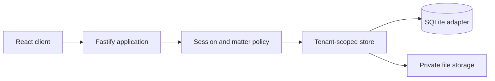

# SwiftClaim Litigation

SwiftClaim Litigation is the first working slice of a modern, AI-ready litigation operating system. Step 1 establishes the secure matter spine that every later capability—SwiftBridge migration, document intelligence, calling, communications, billing, and automation—will depend on.

This repository contains a real full-stack application, not a static prototype. The React interface uses a Fastify API, a durable SQLite database, private file storage, secure sessions, firm and matter-level access rules, and append-only evidential records.

## What works now

- secure email/password sessions with scrypt hashes and revocation;
- server-derived firm isolation on every tenant-owned query;
- role and matter membership permissions;
- litigation dashboard with urgent work and deadline counts;
- matter creation with Proclaim-compatible migration identifiers;
- parties, tasks, assignments, completion history, and matter chronology;
- private document upload, SHA-256 hashing, immutable version rows, and authorised downloads;
- append-only audit records protected by database triggers;
- responsive desktop, tablet, and mobile interface;
- seeded two-firm evaluation dataset;
- automated domain, security, API, client, and production-build checks.

## Quick start

Requirements: Node.js 24 or newer and npm 11 or newer.

```bash
npm install
npm run dev
```

Open `http://127.0.0.1:5173`. Vite proxies the API to `http://127.0.0.1:4100`.

The development command creates `./data/swiftclaim.sqlite` and `./data/uploads`. Both are ignored by Git.

### Evaluation accounts

All seeded users use the password `SwiftClaim!2026`.

| User | Email | Access to demonstrate |
|---|---|---|
| Ava Morgan | `ava@northstar.test` | Solicitor; assigned Northstar matter only |
| Marcus Reed | `partner@northstar.test` | Partner; all Northstar matters and matter creation |
| Ben Foster | `ben@northstar.test` | Paralegal; assigned matters only |
| Priya Shah | `finance@northstar.test` | Firm-wide read-only access |
| Lewis Grant | `lewis@southbank.test` | Separate Southbank firm tenant |

Use Ava for the main workflow. Use Marcus to open a matter. Use Lewis to verify that Northstar matter UUIDs and documents remain invisible across firms.

## Commands

```bash
npm run dev        # API and web development servers
npm test           # all server and client tests
npm run typecheck  # strict browser and server TypeScript checks
npm run build      # production server and client build
npm start          # serve the production build on port 4100
```

To exercise a production build with demonstration data:

```bash
npm run build
SEED_DEMO_DATA=true npm start
```

Then open `http://127.0.0.1:4100`.

## Architecture

SwiftClaim Step 1 is a modular monolith. That keeps transactions, tenant controls, and deployment simple while the domain is still being discovered with the test firm.



The boundaries are deliberately portable:

- `src/shared/contracts.ts` owns validated request contracts;
- `src/server/policy.ts` owns role decisions;
- `src/server/store.ts` owns tenant-scoped matter operations;
- `src/server/storage.ts` owns immutable bytes and hashes;
- `src/server/app.ts` maps HTTP requests to those boundaries;
- `src/client/` consumes only the public `/api` contracts.

SQLite and local storage are evaluation adapters. The same contracts can move to PostgreSQL and encrypted object storage without rewriting the browser application.

## Security model

The server never accepts a firm identifier from the browser. It resolves the firm and user from a random session token stored in an HTTP-only, same-site cookie. Only the SHA-256 token hash is stored in the database.

Administrative and partner roles can read and write every matter in their firm. Solicitors and paralegals need ownership or explicit membership. Finance and read-only roles can read firm matters but cannot mutate them. Inaccessible matters and child resources return `404`, including resources in another firm, to avoid existence disclosure.

Every tenant-owned table carries `firm_id`. Composite foreign keys prevent a child record from crossing a firm boundary. Audit and document-version rows have database triggers that reject updates and deletion. Uploaded names never become storage paths; files receive random storage keys and an SHA-256 digest.

Security acceptance tests live in:

- `src/server/security.test.ts`;
- `src/server/database.test.ts`;
- `src/server/app.test.ts`.

## Matter and migration model

SwiftClaim uses its own stable UUIDs as primary keys. `external_source`, `external_id`, and `import_batch_id` preserve Proclaim or other legacy references as compatibility metadata. They never become authoritative identifiers.

This makes the future SwiftBridge flow idempotent and reconcilable:

1. map a source entity to a canonical SwiftClaim entity;
2. retain its legacy key for exception reporting;
3. hash every transferred file for byte-level reconciliation;
4. group imported records by batch;
5. record import actions in the same append-only audit model.

The approved Step 1 design and implementation plan are in `docs/superpowers/`.

## API surface

| Method | Route | Purpose |
|---|---|---|
| `POST` | `/api/auth/login` | Create a secure session |
| `POST` | `/api/auth/logout` | Revoke the session |
| `GET` | `/api/me` | Current user, firm, and permissions |
| `GET` | `/api/dashboard` | Accessible work summary |
| `GET` | `/api/matters` | Accessible matters and search |
| `POST` | `/api/matters` | Create a matter as partner/admin |
| `GET` | `/api/matters/:id` | Full authorised matter aggregate |
| `POST` | `/api/matters/:id/parties` | Add a matter party |
| `POST` | `/api/matters/:id/tasks` | Add a task or deadline |
| `PATCH` | `/api/matters/:id/tasks/:taskId` | Update task state |
| `POST` | `/api/matters/:id/documents` | Preserve a document version |
| `GET` | `/api/matters/:id/documents/:documentId/download` | Authorised download |

Every JSON error has the same envelope: `{ "error": { "code", "message", "fields"? } }`.

## Configuration

Copy `.env.example` values into your process environment. The application does not load `.env` files itself; use your preferred secret/runtime manager.

| Variable | Default | Purpose |
|---|---|---|
| `HOST` | `127.0.0.1` | Listen address |
| `PORT` | `4100` | API and production web port |
| `NODE_ENV` | `development` | Cookie, CSRF, cache, and seed posture |
| `DATA_DIR` | `./data` | Default durable data directory |
| `DATABASE_PATH` | `DATA_DIR/swiftclaim.sqlite` | SQLite database path |
| `STORAGE_PATH` | `DATA_DIR/uploads` | Private immutable byte storage |
| `SEED_DEMO_DATA` | true outside production | Add the two-firm evaluation dataset |
| `LOG_LEVEL` | `warn` development, `info` production | Structured server log level |

## Live-data boundary

Step 1 is suitable for product evaluation with synthetic or properly anonymised data. It is not approved for live client material.

Before a live pilot, replace the evaluation adapters with managed PostgreSQL and encrypted object storage, add SSO and MFA, managed secrets, malware scanning, encrypted and tested backups, centralised audit export, monitoring and alerting, retention and legal-hold policies, vulnerability management, penetration testing, DPIA/data-flow documentation, and the firm's approved regulatory controls.

## Next build

The next product slice should be SwiftBridge discovery and import rehearsal against an anonymised export from the test firm's Proclaim environment. It should produce a source inventory, mapping rules, document manifest, reconciliation totals, exception queue, and repeatable dry-run report before any cutover tooling is attempted.

Once that data path is trustworthy, the next user-facing layer is cited document intelligence: OCR, disclosure-set ingestion, page-level retrieval, cited summaries, chronology extraction, and approval-gated drafting. AI output should remain a versioned suggestion linked to its source evidence, never an untracked mutation of the matter record.
