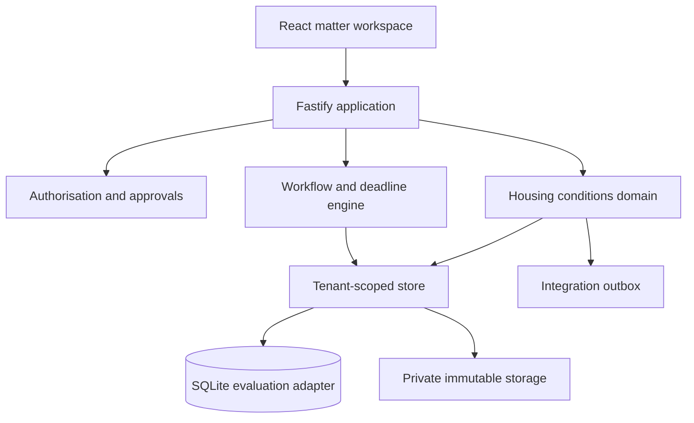

# SwiftClaim Claimant Housing Disrepair CMS Design

**Status:** Approved product direction; implementation specification pending user review  
**Date:** 13 July 2026  
**Product:** SwiftClaim Litigation  
**First configured practice area:** Claimant housing conditions claims in England

## 1. Decision

SwiftClaim will first become a complete operational case-management system for claimant solicitors handling straightforward housing conditions claims in England. It will use a configurable workflow engine rather than hard-coded screens and transitions. Housing Disrepair will be the first polished workflow template and the reference implementation for future litigation types.

This programme comes before SwiftBridge, AI document intelligence and WhatsApp calling. The destination system must be operationally complete before migration and intelligence layers are attached to it.

"Complete" in this specification means complete for the day-to-day conduct, supervision and reporting of a claimant housing conditions matter from enquiry through closure. It includes matter finance but not a regulated double-entry client-account ledger. A full legal accounts product remains a separately controlled SwiftClaim Finance programme.

## 2. Goals

The system must let a claimant firm:

1. capture, assess and accept a new enquiry;
2. complete conflict, identity, authority, funding and onboarding controls;
3. record the client, household, tenancy, property, landlord and instructed parties;
4. maintain a room-by-room defect and repair register;
5. prove notice, landlord knowledge, access, complaints and repair history;
6. collect and classify photographs, videos, correspondence and losses;
7. conduct the Housing Conditions Pre-Action Protocol with controlled deadlines;
8. instruct and manage experts, inspections and reports;
9. monitor remedial works and post-work evidence;
10. value damages and special damages and manage offers;
11. conduct Part 7 proceedings and court directions where required;
12. record every note, communication, task, deadline, document and material decision;
13. record time, rates, WIP, disbursements, bills, costs offers and payment status;
14. supervise risk, inactivity, limitation, undertakings and compliance;
15. close and retain a complete, explainable matter record; and
16. expose stable data contracts for later AI, communications and SwiftBridge modules.

## 3. Non-goals for this programme

The following are intentionally deferred until the case-management programme is complete:

- automated AI summaries, drafting or legal recommendations;
- WhatsApp messaging or calling;
- automated call transcription;
- Proclaim extraction and SwiftBridge import tooling;
- a client or referrer self-service portal;
- double-entry office/client accounting, bank reconciliation and SRA Accounts Rules processing;
- live production use with identifiable client material while evaluation storage and authentication adapters remain in place.

The case-management data model must nevertheless contain clean seams for these capabilities.

## 4. Jurisdiction and assumptions

- The first template is claimant-side and England-only.
- The workflow is based on the current Pre-Action Protocol for Housing Conditions Claims (England), relevant Civil Procedure Rules and current statutory duties.
- The firm business timezone defaults to `Europe/London`.
- Working-day calculations use the firm's business calendar and an effective-dated England and Wales bank-holiday calendar.
- The software assists solicitors; it does not make legal decisions.
- A user must confirm material trigger facts such as receipt, deemed service, inspection, issue, service, order receipt and settlement.
- Every calculated deadline shows the trigger, rule, source version, calendar and override history.
- Rules and templates are effective-dated so a later legal change does not rewrite historic matters.
- Housing conditions and related personal injury elements can coexist on a matter, but specialist personal-injury workflow is not automated in this first template.

## 5. Product architecture

SwiftClaim remains a modular monolith during evaluation. This preserves simple deployment and transactional integrity while the product is validated with the test firm.

The boundaries are:

- **Policy:** firm, role, matter membership, approval and field-level mutation rules;
- **Workflow:** templates, stage transitions, generated tasks, dependencies and deadline calculations;
- **Housing conditions domain:** property, tenancy, defects, notice, experts, works, damages, offers and proceedings;
- **Matter operations:** notes, communications, documents, calendar, time and financial status;
- **Store:** all tenant-scoped transactions and append-only event creation;
- **Integration outbox:** reliable future email, calendar, accounting, AI and SwiftBridge events.

No route may write directly to the database. Domain services validate a command, execute one transaction and append timeline and audit evidence before returning.

The current create-if-missing schema bootstrap will be replaced by ordered, forward-only database migrations before the first domain slice lands. Every migration is transactional where SQLite permits it, records its checksum and version, and is tested both from an empty database and from the Step 1 schema. Destructive migrations require an explicit data-copy and verification step.

## 6. Firm-wide navigation

The authenticated application will expose:

1. **Home** — urgent work, overdue deadlines, inactive cases, hazards and approvals;
2. **Matters** — saved views, filters, bulk assignment and search;
3. **Tasks & Calendar** — user/team agenda, deadlines and dependencies;
4. **Contacts** — deduplicated people and organisations reused across matters;
5. **Documents** — authorised cross-matter document search and templates;
6. **Time & Finance** — timers, unposted time, WIP, disbursements and bills;
7. **Reports** — operational, financial, risk and workflow performance;
8. **Administration** — users, teams, roles, rates, calendars, templates, custom fields and workflow versions.

## 7. Matter 360 workspace

The matter header remains visible and shows reference, client, property, stage, owner, supervisor, risk, next deadline, outstanding works and financial position.

The workspace sections are:

- **Overview:** matter position, next actions, alerts, stage checklist and recent activity;
- **Client & Household:** identity, contact preferences, vulnerabilities, occupiers, authority and onboarding;
- **Property & Tenancy:** address, landlord, landlord type, tenancy, rent, occupancy and move dates;
- **Defects & Repairs:** room-level defect register, severity, notice, access, works and verification;
- **Evidence:** photographs, videos, complaints, repair records, losses and evidence gaps;
- **Documents:** folders, tags, categories, versions, previews, links and bundles;
- **Communications & Notes:** attendance notes, calls, emails, letters, messages and internal notes;
- **Protocol & Experts:** Letter of Claim, response, disclosure, expert proposals, instructions, inspection and report;
- **Damages & Offers:** general damages periods, special damages, valuation, offers, approvals and settlement history;
- **Proceedings:** claim details, issue, service, statements of case, allocation, directions, hearings, orders and compliance;
- **Tasks & Calendar:** generated/manual work, dependencies, reminders and workload;
- **Time & Finance:** time, rates, WIP, disbursements, estimates, bills, costs offers and receipts;
- **Chronology:** filterable evidential chronology across every matter event;
- **Audit:** append-only mutation record with before/after state and request identifiers.

Desktop uses a dense two-column operational layout with a collapsible section rail. Tablet and mobile collapse to a single column while preserving next actions and critical deadlines at the top. The design must avoid decorative empty space and keep primary work visible without excessive scrolling.

## 8. Claim lifecycle and stages

Stages are ordered but not rigid. Authorised users may move backwards, skip an optional stage or place the matter on hold, but must record a reason. Stage transitions run readiness checks and never silently discard incomplete work.

### 8.1 Enquiry

- capture source, referrer, contact and basic property information;
- record defects, complaint dates, landlord type, current occupancy and desired outcome;
- run duplicate client/property/matter and conflict searches;
- record urgency, immediate safety concerns and communication requirements;
- decide: progress to assessment, decline, refer, duplicate or unable to contact.

### 8.2 Assessment

- confirm the property is in England and the claimant has the relevant relationship to it;
- assess notice/knowledge, unresolved conditions, broad duration, access history and available evidence;
- record potential section 11, fitness, statutory and contractual issues without auto-determining liability;
- identify personal injury, possession, homelessness, safeguarding or urgent-injunction escalation;
- record merits, proportionality and supervisor decision.

### 8.3 Onboarding

- create/reuse the contact and household records;
- capture ID/verification status rather than raw sensitive identity images in general fields;
- record client care, authority, funding arrangement, privacy notice and electronic signature status;
- record vulnerability, accessibility, interpreter and safe-contact requirements;
- assign owner, supervisor and team.

### 8.4 Evidence and notice investigation

- build the property and tenancy profile;
- create defects by room/location and link supporting evidence;
- build a notice/complaint chronology with channel, recipient, proof and response;
- record attempted/completed access and landlord works;
- identify missing evidence using a configurable checklist;
- generate client evidence requests and follow-ups.

### 8.5 Pre-Action Protocol

- generate a Letter of Claim from approved data and a versioned template;
- require user confirmation of dispatch method/date and actual or deemed receipt;
- generate the response and disclosure deadline from the effective rule version;
- track landlord response, disclosure completeness, liability position, proposed works, compensation and costs;
- retain the exact rule and source used for every generated date;
- flag protocol breach without automatically deciding to issue.

The current official protocol ordinarily requires a landlord response within 20 working days of receipt. It also describes the information, disclosure and expert proposals expected in the Letter of Claim. The engine will model this as effective-dated rules rather than literal dates in application code.

### 8.6 Expert evidence

- propose an expert and attach CV and proposed instructions;
- track single joint expert agreement, separate instructions or joint inspection;
- manage appointment, access, inspection, report due date, report receipt and questions;
- capture each defect, cause, works, urgency, cost estimate and disagreement from the report as structured records;
- preserve the original report as immutable evidence;
- require authorised review before imported report findings alter the claim position.

The current protocol provides for inspection within 20 working days of the landlord's response and a report or agreed schedule ordinarily within 10 working days of inspection. These are versioned rules with user-confirmed triggers.

### 8.7 Repairs and quantum

- convert accepted expert items or landlord proposals into repair work items;
- record responsible party, access appointments, promised/completed dates and evidence;
- identify overdue, failed, partial and disputed works;
- record post-work photographs, client confirmation and reinspection;
- maintain general-damages periods, special-damages items, supporting evidence and valuation ranges;
- separate claimed, offered, agreed and paid amounts.

### 8.8 Negotiation and ADR

- record offers with type, scope, amount, costs treatment, repair terms, expiry and status;
- support Part 36 and non-Part 36 classifications without auto-advising acceptance;
- require configurable approval where an offer falls outside authority or policy;
- show a chronological comparison of damages, works, costs and non-monetary terms;
- record ADR consideration and outcome.

### 8.9 Proceedings

- record intended court, parties, remedies, pleaded value and issue authority;
- generate a controlled issue checklist and document pack;
- record claim number, issue, service method/date and confirmed/deemed service;
- calculate acknowledgement/defence dates only from confirmed triggers and effective rules;
- record defence, reply, directions questionnaire, track/complexity band, directions, disclosure, witness evidence, expert evidence, hearing and orders;
- create deadline chains from court orders while requiring user confirmation;
- preserve superseded directions and deadline revisions.

### 8.10 Settlement, compliance and closure

- record the approved settlement instrument and complete terms;
- monitor damages, costs, works, access and payment obligations separately;
- keep the matter operational until all settlement obligations are satisfied or waived with authority;
- complete final client reporting, balance/payment status, document return and retention checks;
- record closure reason, outcome, lessons and reopened history.

## 9. Configurable workflow engine

### 9.1 Definitions

The engine stores versioned:

- workflow templates;
- stages and permitted transitions;
- stage entry/exit checklists;
- action templates;
- task dependencies;
- deadline rules;
- reminders and escalations;
- required/optional data conditions;
- approval policies;
- document template links;
- risk rules; and
- report dimensions.

A matter is pinned to a workflow version. An administrator may migrate it to a newer version through a preview showing generated, changed and removed actions. Historic calculations and completed tasks remain attached to the original rule version.

### 9.2 Deadline rule model

Each rule contains:

- stable rule key and version;
- human-readable name;
- jurisdiction and matter type;
- trigger event type;
- offset and unit: elapsed days, calendar days or working days;
- inclusion/exclusion convention;
- time-of-day and timezone;
- business calendar;
- effective-from/effective-to dates;
- official source title, URL and retrieval/version date;
- reminder/escalation schedule;
- whether user confirmation is required; and
- whether an authorised override is permitted.

Each calculated deadline stores the trigger event, calculation inputs, result, explanation, source version, creator, confirmation and every override. Recalculation creates a superseding record rather than mutating history.

### 9.3 Task generation

Domain events generate tasks idempotently using a unique `(matter, workflow version, action key, trigger event)` identity. Replaying an event cannot duplicate work. Generated tasks can be rescheduled or reassigned with reasons but retain their source and dependency graph.

## 10. Domain data model

Every tenant-owned table includes `firm_id`, canonical UUIDs and optional `external_source`, `external_id` and `import_batch_id` fields. Composite foreign keys continue to enforce firm isolation.

### 10.1 Reusable practice entities

- `contacts` and `organisations` with deduplication keys and communication preferences;
- `contact_addresses`, `contact_channels` and `contact_relationships`;
- `matter_participants` linking reusable contacts/organisations to matter roles;
- `teams`, `user_teams`, `matter_assignments` and supervisor roles;
- `conflict_checks`, searched identities, results and authorised decisions;
- `onboarding_controls` for identity, authority, client care, privacy, funding and signature status;
- `custom_field_definitions`, `custom_field_options` and typed `custom_field_values`;
- `matter_flags`, `approvals` and `approval_decisions`;
- `matter_reviews`, review findings, actions and supervisor sign-off;
- `undertakings` and immutable satisfaction/release history;
- `retention_schedules`, `legal_holds` and controlled export records.

The existing `parties` table remains readable during migration but is replaced at the domain boundary by reusable contacts and matter participation.

### 10.2 Housing conditions entities

- `housing_cases` — template-specific summary and claimant position;
- `properties` — UPRN-ready address, type and occupancy metadata;
- `tenancies` — landlord, type, start/end, rent and occupancy;
- `household_members` — relationship, occupancy, vulnerability and claim participation;
- `defects` — location, category, description, severity, first observed, status and health impact;
- `defect_evidence_links` — defect-to-document/photo/video relationships;
- `notices` — complaint/notice event, recipient, channel, proof and response;
- `access_events` — offered, attempted, refused, completed or failed access;
- `repair_items` and `repair_events` — required works, owner, dates, status and verification;
- `expert_instructions`, `inspections`, `expert_reports`, `expert_findings` and `expert_questions`;
- `loss_items` — type, period, amount, evidence and recovery status;
- `quantum_positions` — general damages, special damages and valuation history;
- `offers` and `offer_terms` — monetary, costs, repairs and other terms;
- `settlements`, `settlement_obligations` and `settlement_compliance_events`;
- `proceedings`, `court_documents`, `directions`, `hearings`, `orders` and `order_obligations`.

Money is stored as integer minor units plus ISO currency. Date-only legal dates are stored separately from timestamps. Structured fields never replace the preserved source document.

### 10.3 Operational entities

- `notes` with types: attendance, telephone, internal, advice, conference and review;
- `communications` with direction, channel, participants, subject, occurred time and delivery status;
- `communication_document_links` and future provider identifiers;
- `appointments` and `appointment_attendees`;
- `task_dependencies`, `task_checklist_items` and `task_comments`;
- `document_folders`, `document_tags`, `document_links` and `document_bundle_items`;
- `time_entries`, `timers`, `rate_cards`, `matter_rates` and `activity_codes`;
- `disbursements`, `matter_estimates`, `bills`, `bill_items`, `costs_offers` and `payment_status_events`;
- `client_service_complaints` and resolution/action history;
- `workflow_instances`, `stage_history`, `domain_events`, `integration_outbox` and `notification_deliveries`.

Notes, communications and documents may be corrected only by a superseding version. Audit and chronology remain append-only.

## 11. Documents and correspondence

- Documents use folders for navigation and tags/links for classification.
- Every byte version remains immutable with SHA-256 verification.
- Metadata changes are audited; byte changes create a new version.
- A document may link to multiple defects, notices, tasks, offers, directions or other domain records.
- Templates are versioned and approved by role.
- Generated documents store the template version and a frozen data snapshot.
- Draft, approved, sent, filed, served and superseded states are distinct.
- Bundles are ordered manifests pointing to immutable versions; later rendering cannot alter source documents.
- Full-text extraction and AI indexing are deferred, but extraction status and provenance fields are reserved.

Email integration will later use `communications` and the outbox. Until a provider is connected, users can record correspondence and attach the preserved sent/received document without losing chronology.

## 12. Time and matter finance

The case-management programme includes:

- manual timers and retrospective entries;
- fee earner, activity, narrative, date, units/minutes, rate and value;
- configurable chargeable/non-chargeable activity codes;
- effective-dated firm, role, user and matter rates;
- supervisor approval and immutable posted entries with reversing corrections;
- WIP by matter, phase, task, fee earner and period;
- disbursement requested, approved, incurred, paid, recovered and written-off states;
- damages/costs/payment settlement tracking;
- bill headers and matter-level billing status;
- costs authority, costs offers and costs settlement history;
- estimates and warnings when WIP or disbursements exceed authority.

It does not post bank transactions, operate client accounts or perform double-entry accounting.

## 13. Permissions and approvals

Existing firm and matter isolation remains mandatory. The role model expands with capabilities rather than accumulating route-specific role checks.

Examples include:

- matter create, view, edit, close and reopen;
- client-sensitive data view/edit;
- deadline create, confirm and override;
- document upload, approve, send, file and serve;
- offer record, recommend and approve;
- issue authority and settlement authority;
- time record, approve, post and reverse;
- finance view and bill control;
- workflow/template administration;
- audit export.

High-impact actions use explicit approval records, not a boolean. An approval stores request, scope, supporting data, requester, decision-maker, decision, reason, expiry and related document version.

Inaccessible resources continue to return `404` to avoid cross-tenant disclosure. Bulk actions authorise every selected matter independently and fail safely without partial unauthorised mutation.

## 14. Chronology, audit and legal provenance

The matter chronology is a solicitor-readable evidential view. The audit trail is a security and integrity record. They are related but not interchangeable.

Every material command emits:

1. an immutable domain event;
2. a human-readable timeline event where appropriate;
3. an immutable audit event with before/after data;
4. generated workflow work, if applicable; and
5. an outbox event for future integrations.

Legal rules and approved document templates have a source register containing jurisdiction, authority, URL, effective date, retrieval date and reviewer. A rule update creates a new version and a review task; it never silently changes historic matters.

## 15. Risk and supervision

The system provides explainable flags, not automated legal conclusions. Initial rules include:

- no future task or deadline on an open matter;
- overdue protocol, court or settlement obligation;
- matter inactive beyond configured days;
- urgent hazard or vulnerability without same-day review;
- limitation/issue date absent or approaching;
- missing notice evidence;
- failed or repeatedly cancelled access;
- expert report overdue or unreviewed;
- promised works overdue or disputed;
- offer awaiting authority or response;
- order obligation incomplete;
- undertaking approaching or past its required date;
- scheduled supervisor review overdue;
- WIP/disbursement authority exceeded;
- client not updated within policy interval.

Each flag explains its triggering data, owner, severity, creation time and resolution. Dismissing a flag requires a reason and does not remove history.

For social housing cases, the matter can record Awaab's Law-relevant hazards and landlord response evidence. The current guidance is effective-dated and treated as an escalation aid, not an automatic liability decision.

## 16. Search, views and reporting

### 16.1 Search

Authorised users can search reference, client, property, landlord, claim number, contact details, document metadata, task title and selected structured fields. Search results are permission-filtered before ranking or counts are returned.

### 16.2 Saved operational views

Initial firm views include:

- my open matters;
- unallocated enquiries;
- urgent hazards;
- onboarding incomplete;
- Letter of Claim due;
- protocol response overdue;
- expert inspection/report overdue;
- repairs overdue;
- offers awaiting decision;
- issued matters with next court deadline;
- settlement obligations outstanding;
- inactive matters;
- unposted time and unrecovered disbursements.

### 16.3 Reports

Initial reports include matter volumes by stage/owner/referrer/landlord, conversion and decline reasons, stage ageing, protocol compliance, defects and works outcomes, settlement values, cycle time, task performance, WIP, disbursements and recoveries. Every metric has a documented definition and respects matter access.

## 17. Error handling and concurrency

- All commands use validated schemas and one database transaction.
- Expected domain failures return stable codes and field errors.
- Optimistic concurrency uses an entity version on mutable aggregates. Stale updates return `409 CONFLICT` with current version metadata.
- Idempotency keys protect document generation, workflow actions and future integration commands.
- Failed workflow side effects do not roll back the primary legal record; they enter a visible retry/exception queue through the outbox.
- File failures never create a document version without successfully preserved bytes and hash.
- No exception exposes another firm's identifiers or raw internals.
- Destructive domain actions are represented as cancellation, reversal, supersession or archive events rather than record deletion.

## 18. API and frontend boundaries

The API will grow by resource, not by one oversized matter aggregate. Matter summary and critical next actions load first; sections load independently with pagination.

Representative resources are:

- `/api/matters/:matterId/summary`
- `/api/matters/:matterId/workflow`
- `/api/matters/:matterId/housing-case`
- `/api/matters/:matterId/defects`
- `/api/matters/:matterId/notices`
- `/api/matters/:matterId/repairs`
- `/api/matters/:matterId/experts`
- `/api/matters/:matterId/quantum`
- `/api/matters/:matterId/offers`
- `/api/matters/:matterId/proceedings`
- `/api/matters/:matterId/communications`
- `/api/matters/:matterId/time`
- `/api/matters/:matterId/finance`

Shared contracts remain in `src/shared`. Server response types are explicit and do not leak database rows. Frontend pages use resource-specific data hooks and mutation invalidation rather than reloading the entire matter after every action.

## 19. Evaluation data

Northstar Legal becomes the claimant housing conditions demonstration firm. The primary seeded matter becomes a realistic, entirely fictional social-housing claim containing:

- client and household;
- tenancy and landlord;
- five room-level defects;
- a multi-channel notice history;
- photographs represented by safe synthetic files;
- Letter of Claim and response workflow;
- expert proposal and inspection;
- repair items;
- damages and one offer;
- time and disbursement entries; and
- supervision flags.

Southbank Law remains the separate tenant used to prove isolation. No real client data or copied firm templates enter the repository.

## 20. Testing strategy

### 20.1 Domain tests

- every permitted and prohibited stage transition;
- workflow version pinning and previewed migration;
- working-day, bank-holiday, timezone and effective-date calculations;
- trigger confirmation and deadline supersession;
- idempotent task generation;
- defect, notice, access, repair and expert state machines;
- offer and settlement obligation state transitions;
- immutable posting/reversal of time and finance records;
- concurrency conflicts and transaction rollback.

### 20.2 Security tests

- cross-firm access for every new resource;
- matter membership and capability enforcement;
- approval boundaries;
- search and report count non-disclosure;
- bulk-action partial authorisation prevention;
- immutable audit, chronology, document and posted-finance records.

### 20.3 API tests

- valid and invalid commands;
- stable error envelopes;
- pagination and filtering;
- file/document atomicity;
- idempotency and retry;
- outbox exception visibility.

### 20.4 Client tests

- complete enquiry-to-closure happy path;
- urgent hazard escalation;
- Letter of Claim and expert workflow;
- court deadline workflow;
- settlement compliance;
- keyboard access, focus management and responsive layouts;
- loading, empty, permission-denied, conflict and failure states.

### 20.5 End-to-end acceptance

A fresh evaluation environment must let a solicitor open the seeded matter, understand its position in under one minute, complete the next task, record evidence, send the matter through protocol/expert/repairs/settlement stages, record time and close it without using the database or developer tools.

## 21. Delivery programme

Implementation will proceed in independently verifiable vertical slices:

1. **Matter 360 foundation:** versioned workflow engine, deadline engine, business calendars, capabilities and sectioned API shell;
2. **Intake and onboarding:** enquiries, conflicts, reusable contacts, household, property, tenancy, authority and assessment;
3. **Defects and evidence:** room-level register, notice, access, evidence linking, risk flags and chronology;
4. **Protocol and experts:** Letter of Claim workflow, disclosure, expert instruction, inspection, report and findings;
5. **Repairs, quantum and offers:** works tracking, losses, valuations, approvals and settlement terms;
6. **Proceedings:** issue/service, statements of case, track, directions, hearings, orders and compliance;
7. **Operational depth:** notes, communications, document folders/templates/bundles, task dependencies and calendar;
8. **Time, finance and reporting:** rates, WIP, disbursements, bills, costs status, views and management reports;
9. **Administration and hardening:** workflow/template administration, concurrency, exception queue, retention/legal hold, controlled exports, accessibility and performance.

Each slice must ship with tests, seeded demonstration state, audit coverage and a browser-verified solicitor journey. No later slice may weaken tenant isolation or append-only evidence.

## 22. Programme acceptance criteria

The Housing Disrepair CMS programme is complete when:

1. every lifecycle stage in section 8 is operable through the UI;
2. every material record is tenant-scoped, permission-controlled and audited;
3. the deadline engine explains and preserves every calculation;
4. the system supports protocol, expert, repairs, negotiation, proceedings, settlement and closure paths;
5. documents, notes, communications, tasks and chronology form one coherent matter record;
6. solicitors can record time and matter-level financial position;
7. supervisors can identify risk, inactivity, workload and financial exceptions without spreadsheets;
8. a complete synthetic matter can be run end to end in browser acceptance testing;
9. cross-tenant and inaccessible-resource tests pass for every new module;
10. type checking, automated tests and production builds pass from a clean checkout; and
11. documentation clearly distinguishes evaluation readiness from approval for live client data.

## 23. Authoritative source register for the first workflow

- [Pre-Action Protocol for Housing Conditions Claims (England)](https://www.justice.gov.uk/courts/procedure-rules/civil/protocol/prot_hou)
- [CPR Part 7 and Practice Direction 7A](https://www.justice.gov.uk/courts/procedure-rules/civil/rules/part07)
- [CPR Part 15: Defence and Reply](https://www.justice.gov.uk/courts/procedure-rules/civil/rules/part15)
- [CPR Part 26: Case Management and Allocation](https://www.justice.gov.uk/courts/procedure-rules/civil/rules/part26)
- [CPR Part 35: Experts and Assessors](https://www.justice.gov.uk/courts/procedure-rules/civil/rules/part35)
- [CPR Part 36: Offers to Settle](https://www.justice.gov.uk/courts/procedure-rules/civil/rules/part36)
- [Landlord and Tenant Act 1985, section 11](https://www.legislation.gov.uk/ukpga/1985/70/section/11)
- [Landlord and Tenant Act 1985, section 9A](https://www.legislation.gov.uk/ukpga/1985/70/section/9A)
- [Homes (Fitness for Human Habitation) Act 2018](https://www.legislation.gov.uk/ukpga/2018/34)
- [Awaab's Law guidance for social landlords](https://www.gov.uk/government/publications/awaabs-law-guidance-for-social-landlords/awaabs-law-guidance-for-social-landlords-timeframes-for-repairs-in-the-social-rented-sector)

These sources establish the first rule set. They must be reviewed by an authorised legal user before a production workflow is activated and re-reviewed whenever an effective-dated source changes.
